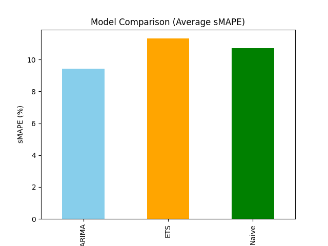
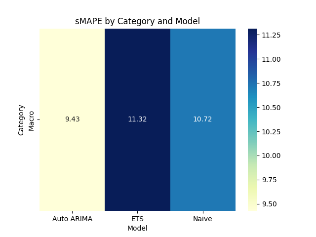
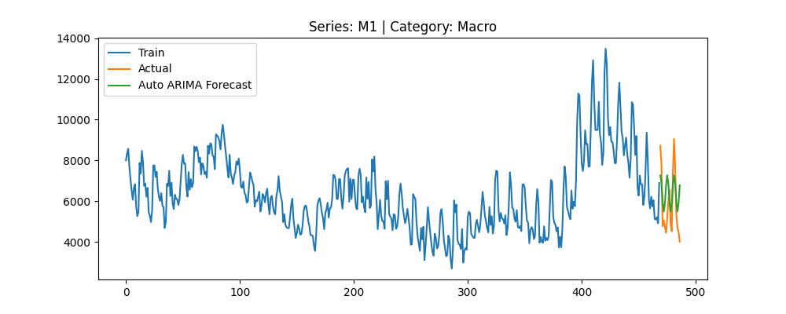

# Forecasting Monthly Time Series Using the M4 Dataset

## 📌 Overview
This project focuses on forecasting monthly time series data using the **M4 competition dataset**.  
We implemented and compared multiple statistical forecasting models to predict future values and evaluated them using the **sMAPE metric**.

Key objectives:
- Forecast 50 monthly series from the M4 dataset.
- Compare models: **Naive**, **ETS (Exponential Smoothing)**, and **Auto ARIMA**.
- Analyze performance by category (Macro, Finance, Industry, etc.).
- Visualize results and provide actionable insights.

---

## 📂 Dataset
- **Source:** [M4 Competition Dataset](https://github.com/Mcompetitions/M4-methods/tree/master/Dataset)
- **Files Used:**
  - `Monthly-train.csv` → Training data
  - `Monthly-test.csv` → Actual future values for evaluation
  - `M4-info.csv` → Metadata (category, start date, frequency)
- **Subset Selected:** 50 Monthly time series (Frequency = 12)

---

## 🛠️ Methods
We used three forecasting approaches:

1. **Naive Forecast**  
   A baseline model using the last observed value for all future steps.

2. **ETS (Exponential Smoothing)**  
   Captures level and trend components using additive methods.

3. **Auto ARIMA**  
   Automatically selects the best ARIMA (p,d,q) parameters using stepwise optimization.

**Evaluation Metric:**  
- **sMAPE (Symmetric Mean Absolute Percentage Error)**  
  Lower sMAPE indicates better accuracy.

---

## 📊 Results

### **Average sMAPE by Model**
| Model       | Avg sMAPE (%) |
|-------------|--------------|
| **Auto ARIMA**  | **9.42** |
| Naive       | 10.72 |
| ETS         | 11.31 |

✅ Auto ARIMA achieved the best performance overall.

---

## 📈 Visualizations

### 🔍 Model Comparison

### 📊 sMAPE by Category and Model

### 📈 Example Forecast (Auto ARIMA)

---

## ✅ Key Insights
- **Auto ARIMA** consistently outperformed Naive and ETS.
- Naive remains a strong baseline for stable series.
- ETS could improve by including seasonality.

---

## 🔮 Future Work
- Implement **Seasonal ARIMA (SARIMA)** for seasonal series.
- Compare with **Facebook Prophet** for trend and seasonality handling.
- Explore **LSTM / Neural Network models** for complex patterns.
- Scale analysis to the **entire M4 Monthly dataset** (100k+ series).

---

## 🛠️ Technologies Used
- **Python**
- **pandas**, **numpy**
- **matplotlib**, **seaborn**
- **statsmodels**
- **pmdarima**

---

## 💼 About Me
I am **Ashad K**, an aspiring **Data Analyst / Data Scientist**, passionate about building **data-driven solutions** and **machine learning models**.  
Currently seeking **full-time opportunities** in **Data Science, Machine Learning, and Analytics** roles.

### 📫 Connect with me:
- **LinkedIn:** [linkedin.com/in/ashad-k](https://www.linkedin.com/in/ashad-k)
- **GitHub:** [github.com/Ashad777](https://github.com/Ashad777)
- **Email:** ashadakber32@gmail.com

---
